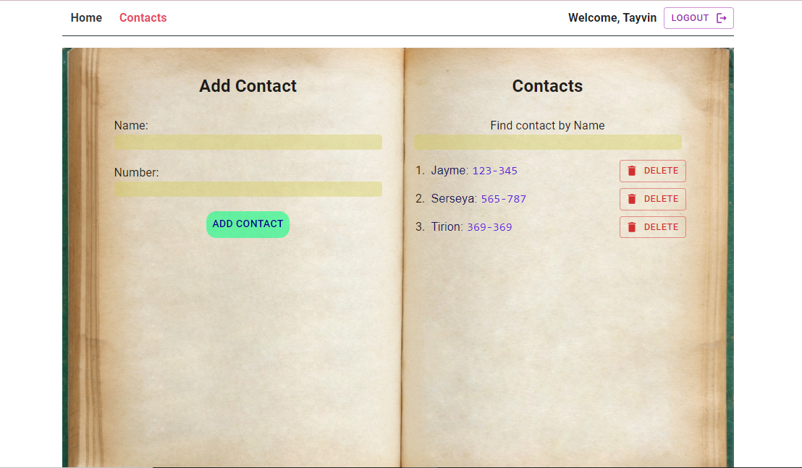
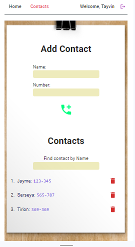

**Read in other languages: [English](README.md), 
[Русский](README.ru.md).**

# Phonebook

Always keep handly the important phone numbers.

___
## Description

_You need register or login - for into contact page, where you can add contact names and phone numbers after that you can see them._ 

_Or mobile version._

___
### Technologyes that i used in this project:
         

---

#### The project has a backend:
[Link into backend repo](https://github.com/Maxximusan/study-pet-proj-2.0)

---

[back to the begining](#suda)